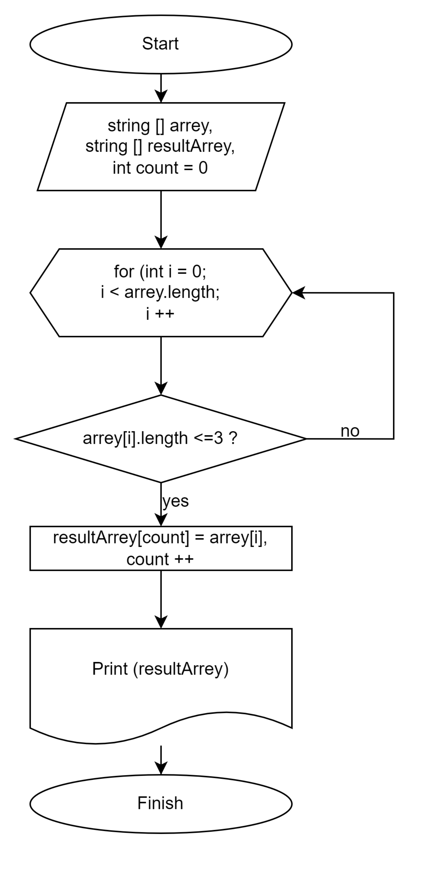

# Итоговая контрольная работа. Основной блок.

## Задача:
 Написать программу, которая из имеющегося массива строк формирует новый массив из строк, длина которых меньше, либо равна 3 символам. Первоначальный массив можно ввести с клавиатуры, либо задать на старте выполнения алгоритма. При решении не рекомендуется пользоваться коллекциями, лучше обойтись исключительно массивами.

**Примеры:**
[“Hello”, “2”, “world”, “:-)”] → [“2”, “:-)”]
[“1234”, “1567”, “-2”, “computer science”] → [“-2”]
[“Russia”, “Denmark”, “Kazan”] → []
## Алгоритм решения:
1. Создать метод *ChechArray*, который принимает два параметра: массив строк array и массив строк resultArray.

2. Внутри метода *ChechArray* создать целочисленную переменную count и инициализировать её значением 0. Эта переменная будет использоваться для отслеживания количества строк, удовлетворяющих условию (длина меньше или равна 3 символам).

3. Запустить цикл *for*, начиная с индекса *i* = 0 и до тех пор, пока *i* меньше длины массива *array*.

4. Внутри цикла проверить длину строки *array[i]* с помощью *array[i].Length*. Если длина меньше или равна 3 символам, выполнить следующее:

    * Добавить строку *array[i]* в массив *resultArray* по индексу *count*.
    * Увеличить *count* на 1.
5. Создать метод *PrintArray*, который принимает один параметр: массив строк *array*.

6. Внутри метода *PrintArray* создать цикл *for*, начиная с *i = 0* и до тех пор, пока *i* меньше длины массива *array*.

7. Внутри цикла вывести каждый элемент массива *array[i]* на консоль с помощью *Console.Write*, добавив пробел после каждого элемента.

8. После завершения цикла *for* перейти на следующую строку с помощью *Console.WriteLine*.

9. Создать массив строк *array* и инициализировать его значениями: *"123", "23", "hello", "world", "res"*.

10. Создать новый массив строк *resultArray* с размером, равным длине массива *array*.

11. Вызвать метод *ChechArray*, передав массив *array* и *resultArray* в качестве аргументов.

12. Вызвать метод *PrintArray*, передав массив *resultArray* в качестве аргумента.

## Дополнительная информация:
блок-схема алгоритма решения задачи:
